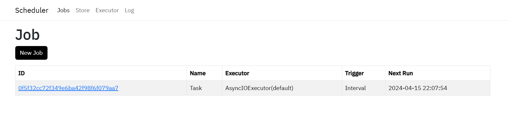

# apscheduler-webui

[](LICENSE) [](https://www.python.org/downloads/release/python-380/) [](https://fastui.fastapi.tiangolo.com/) [](https://github.com/agronholm/apscheduler)

中文 | [English](README_en.md)

**apscheduler-webui** 是一个基于 [APScheduler](https://github.com/agronholm/apscheduler) 和 [FastUI](https://fastui.fastapi.tiangolo.com/) 构建的轻量级任务调度Web服务，旨在提供简洁直观的界面以管理和监控定时任务，同时利用 `APScheduler` 的强大功能实现灵活、高效的后台任务执行。



## 目录

- [apscheduler-webui](#apscheduler-webui)
  - [目录](#目录)
  - [主要特性](#主要特性)
  - [快速开始](#快速开始)
    - [任务管理](#任务管理)
    - [Executor、JobStore管理](#executorjobstore管理)
    - [日志查看](#日志查看)
  - [许可证](#许可证)

## 主要特性

- 创建、编辑、暂停、启动、删除、重载任务
- 支持Cron、Interval、Date触发器
- 创建、删除Executor和JobStore
- 任务执行日志
- 查看脚本文件内容

## 快速开始

1. 克隆本仓库

    ```bash
    git clone https://github.com/Dragon-GCS/apscheduler-webui
    ```

2. 安装依赖

    推荐使用[start](https://github.com/Dragon-GCS/start)

    ```bash
    start init  # 创建虚拟环境（可选）
    start install
    ```

    或者使用`pip`

    ```bash
    python -m venv .venv # 创建虚拟环境（可选）
    pip install .
    ```

3. 启动服务

    ```bash
    uvicron main:app
    ```

### 任务管理

- 在你的脚本中使用apscheduler注册任务

```python
from src.scheduler import scheduler

scheduler.add_job(func, ...)
# or use decorator
@scheduler.scheduled_job(...)
def your_func(...):
    ...
```

- 使用webui（`/new`），通过字符串注册任务：`your_module:your_func`
  > 为了管理脚本，建议将脚本放在指定目录下（比如`scripts`）下并通过`scripts.your_module:your_func`注册任务

### Executor、JobStore管理

- 在`src/config.py`中配置
- 通过webui(`/store`, `/executor`)管理（每次启动服务都会重置）

### 日志查看

- webui(`/log/jobs`)可以查看日志目录(默认为`logs`，可以在`config.py`中配置)中所有`jobs`开头的日志
- 你可以直接使用`loguru.logger`来记录日志，但是日志格式需要使用`src.log.LOG_FORMAT`
- 使用`src.log:server_log`，无需配置即可正确解析。

## 许可证

本项目采用 MIT 许可证。
