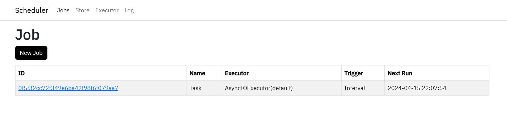

# APScheduler-WebUI

[](LICENSE) [](https://www.python.org/downloads/release/python-380/) [](https://fastui.fastapi.tiangolo.com/) [](https://github.com/agronholm/apscheduler)

[中文](README.md) | English

**APScheduler-WebUI** is a lightweight task scheduling web service built upon [APScheduler](https://github.com/agronholm/apscheduler) and [FastUI](https://github.com/pydantic/FastUI), designed to provide a concise and intuitive interface for managing and monitoring scheduled tasks, while leveraging the powerful capabilities of `APScheduler` to execute background tasks in a flexible and efficient manner.



## Table of Contents

- [APScheduler-WebUI](#apscheduler-webui)
  - [Table of Contents](#table-of-contents)
  - [Features](#features)
  - [Quick Start](#quick-start)
    - [Local Deployment](#local-deployment)
    - [Docker](#docker)
    - [Mange jobs](#mange-jobs)
    - [UV Script Support](#uv-script-support)
    - [Manger Executor and JobStore](#manger-executor-and-jobstore)
    - [Log Management](#log-management)
  - [License](#license)

## Features

- Create, modify, pause, resume, remove and reload jobs
- Support for Cron, Interval, and Date triggers
- Create and delete Executors and JobStores
- Support for view your logs
- View the content of script files

## Quick Start

Clone the repository

  ```bash
  git clone https://github.com/Dragon-GCS/apscheduler-webui
  ```

### Local Deployment

1. Install dependencies

    Use [uv](https://hellowac.github.io/uv-zh-cn/getting-started/installation/)

    > If you only need to use one of sql/mongo/redis as a persistence option, you can install only the corresponding dependencies. By default, all dependencies are installed.

    ```bash
    uv sync --extra all # all = mongo+redis+sql
    ```

    Or use `pip`

    ```bash
    python -m venv .venv # Create virtual environment(Optional)
    pip install .[all]
    ```

2. Start the server

    ```bash
    # use uv
    uv run uvicorn main:app
    # use python
    source .venv/bin/activate # If have virtual environment
    uvicorn main:app
    ```

### Docker

See [docker/DOCKER.md](docker/DOCKER.md)

### Mange jobs

- Register jobs on your scripts

```python
from src.scheduler import scheduler

scheduler.add_job(func, ...)
# or use decorator
@scheduler.scheduled_job(...)
def your_func(...):
    ...
```

- Use WebUI（`/new`），add new job with string: `your_module:your_func`
  > For manage jobs, you can put your jobs under some folder(e.g. `scripts`), and use `scripts.your_module:your_func` to add jobs.


### UV Script Support

If the `uv` command is available, you can run [uv scripts](https://docs.astral.sh/uv/guides/scripts/) by setting `func` to a special value `uv_run`. The script path is passed through the `uv_script` field, and the `args` and `kwargs` fields will be passed as positional and keyword arguments to the script.

> [!NOTE]
> The `uv_run` function calls the `uv run` command via `subprocess` to execute the script, passing parameters to it:
> `uv run {uv_script} {args0} {args1} ... {--key1=value1} {--key2=value2} ...`

### Manger Executor and JobStore

- Configure in `src/config.py`
- Manage through WebUI (`/store`, `/executor`) (will be reset on each service restart)

### Log Management


- WebUI (`/log/jobs`) can parse and view log files recorded in a specific format. Logs are divided into two categories:
  - `scheduler` logs: Record log information output by the scheduler
  - Job logs: Record output log information for each job
- WebUI uses [Loguru](https://github.com/Delgan/loguru) to record and manage logs, and modifies the default log format for easy parsing, so scripts can directly use logs via `from loguru import logger`
  > WebUI modifies the default format of `loguru` by setting the `LOGURU_FORMAT` environment variable, and adds a sink in `src/log.py` to output script logs to the corresponding date file.
- Logs are saved in the `logs/` directory (configurable in `config.py`), where `scheduler.*log` stores `scheduler` logs, and `job.YYYY-MM-DD.log` stores script output logs.

> [!IMPORTANT]
> For uv scripts, `subprocess` inherits environment variables, so no log format needs to be specified. However, if you want to view your script's logs in WebUI, you MUST add a sink manually and there are two methods:
>
> 1. Use the server_log provided by WebUI to record logs
>
>    ```python
>    # The script's working directory is the project root directory, so you can directly import the src module
>    from src.log import server_log as logger
>    logger.info("This is a log message")
>    ```
>
> 2. Manually add a sink in the script to record logs to a file
>
>    ```python
>    from loguru import logger
>    from src.config import LOG_PATH
> 
>    server_log.add(
>      LOG_PATH / "jobs.{time:YYYY-MM-DD}.log", # Filename can be customized
>      rotation=datetime.time(0, 0),  # If the filename contains {time}, it can be rotated daily
>    )
>    ```

## License

This project is licensed under the MIT License.
